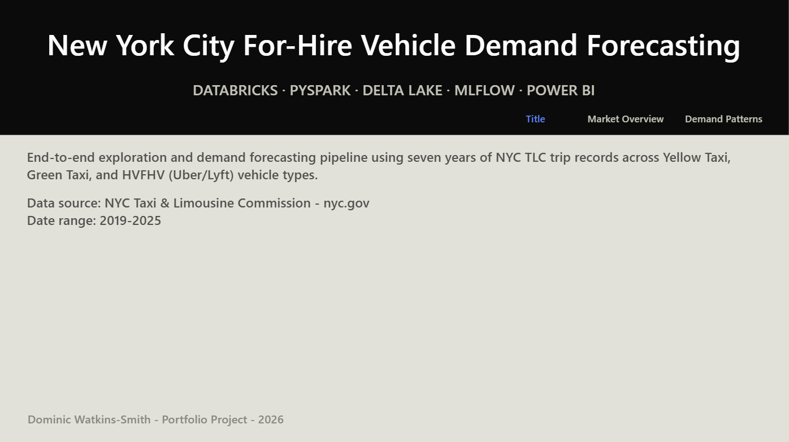
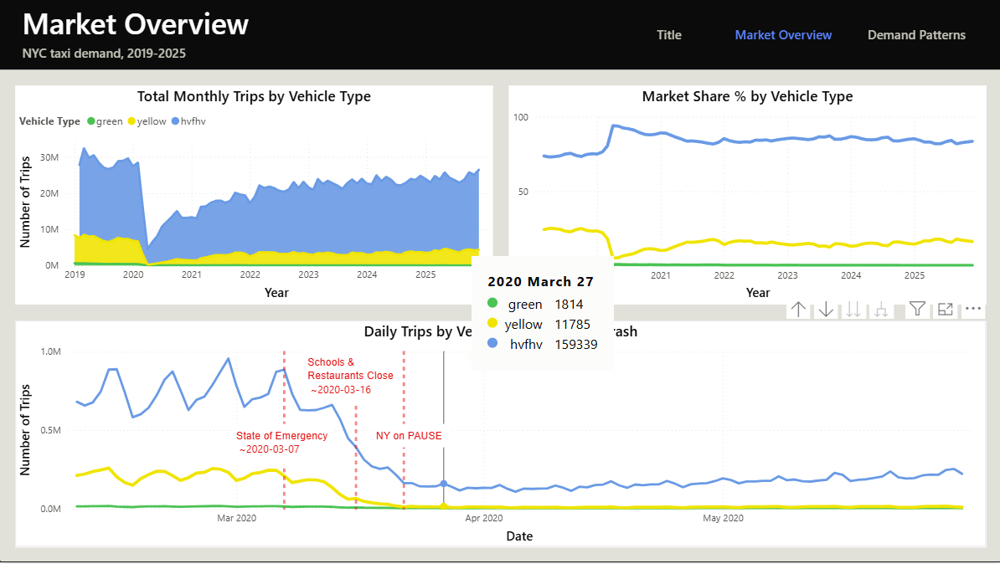
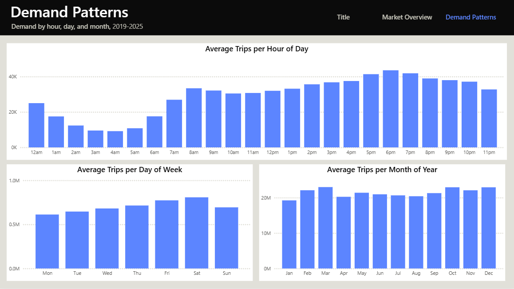
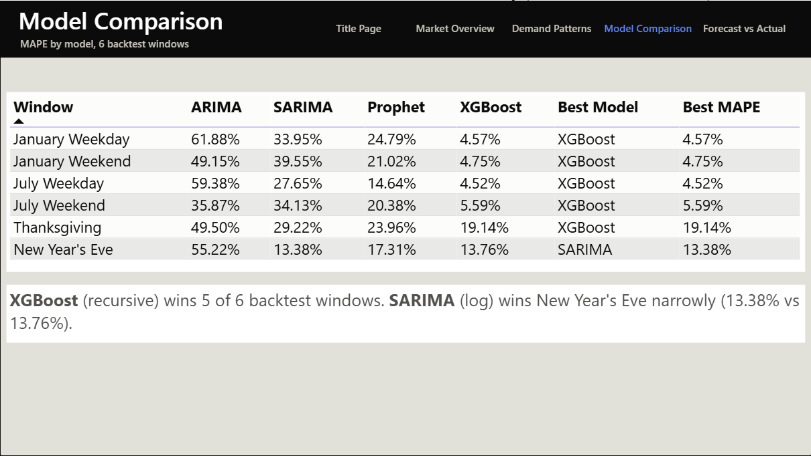
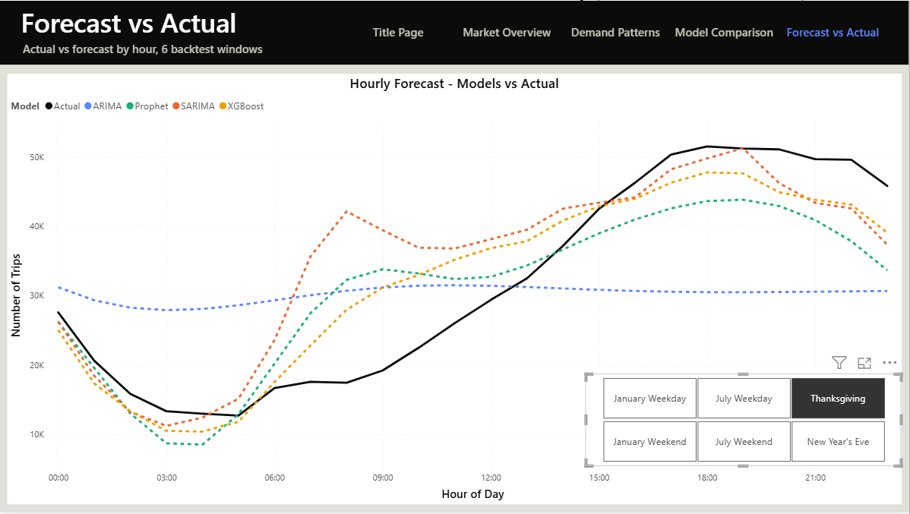
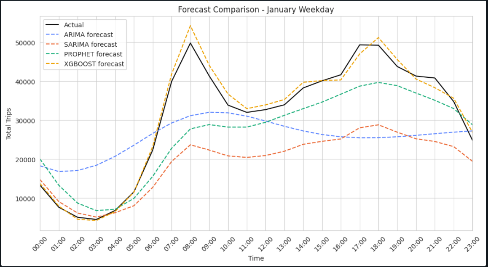
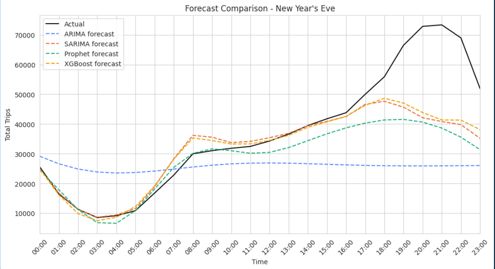

# NYC Taxi Demand Forecasting

An end-to-end data analytics project on NYC TLC trip data: ingestion, exploratory analysis, time-series demand forecasting, and a Power BI dashboard — built entirely on Databricks Free Edition.

## Overview

NYC publishes monthly trip-record data for Yellow taxis, Green (boro) taxis, and High-Volume For-Hire Vehicles (HVFHV — Uber/Lyft/Via). This project pulls that data (2019–2025), aggregates it to hourly demand per vehicle type, explores how the market has shifted over time (including the COVID-19 crash and recovery), engineers calendar/lag/rolling features, backtests four forecasting model families (ARIMA, SARIMA, Prophet, XGBoost) across 6 hand-picked demand regimes, and visualizes both the exploratory analysis and the forecast results in a 5-page Power BI dashboard.

## Tech stack

- **Databricks Free Edition** — PySpark, Delta Lake (managed tables), MLflow
- **Power BI Desktop** — connected directly to a Databricks serverless SQL warehouse (no CSV exports)
- **Python** — pandas, matplotlib for exploratory analysis

## Data

- **Source:** [NYC TLC Trip Record Data](https://www.nyc.gov/site/tlc/about/tlc-trip-record-data.page) — public Parquet files, one per vehicle type per month
- **Range:** 2019–2025, Yellow + Green + HVFHV (~250 source files, ~40–50 GB raw)
- **Storage:** aggregated to a single `hourly_demand` Delta table (`hour`, `vehicle_type`, `trip_count`) — raw files are never persisted, only streamed through and aggregated, to stay within Databricks Free Edition's 10 GB storage quota. See `PIPELINE.md` for the full data flow.

## Project status

| Phase | Status |
|---|---|
| 1 — Ingest (`01_ingest`) | Complete |
| 2 — Exploratory analysis (`02_explore`) | Complete |
| 2b — Power BI dashboard (Pages 1–3, EDA) | Complete |
| 3 — Feature engineering (`03_features`) | Complete |
| 4 — Modelling (ARIMA, SARIMA, Prophet, XGBoost) (`04_modelling`) | Complete |
| 5 — Power BI dashboard (Pages 4–5, forecast results) | Complete |

## Dashboard

Five pages:

| Page | Content |
|---|---|
| Title | Project overview, data source, date range |
| Market Overview | Trips over time by vehicle type, market share %, COVID-19 crash/recovery zoom-in |
| Demand Patterns | Average trips by hour of day, day of week, month of year |
| Model Comparison | MAPE per model (ARIMA/SARIMA/Prophet/XGBoost) across 6 backtest windows, best model per window |
| Forecast vs Actual | Actual vs forecast by hour, all 4 models, with a window slicer |







## Modelling

Four model families were backtested across 6 hand-picked demand regimes (ordinary weekday/weekend in January and July, plus two irregular high-variance windows — Thanksgiving and New Year's Eve) using an expanding-window walk-forward split, tracked with MLflow. **XGBoost (recursive forecasting) won 5 of 6 windows outright**; SARIMA (log-transformed) narrowly won New Year's Eve. Full write-up, per-model variant breakdown, and MLflow experiment details are in `notebooks/04_modelling.ipynb`.




## Repo structure

```
notebooks/          Databricks notebooks (01_ingest, 02_explore, 03_features, 04_modelling)
powerbi/            .pbix dashboard file + theme.json
screenshots/         Final exploratory and dashboard chart images
PIPELINE.md          Full data flow / architecture reference
```

## Optional Future enhancements

- Add weather data as an external regressor (temperature strongly predicts taxi demand)
- Extend to zone-level forecasting (predict demand per NYC borough)
- Fare revenue forecasting (Yellow/Green meter fares vs HVFHV surge pricing)

